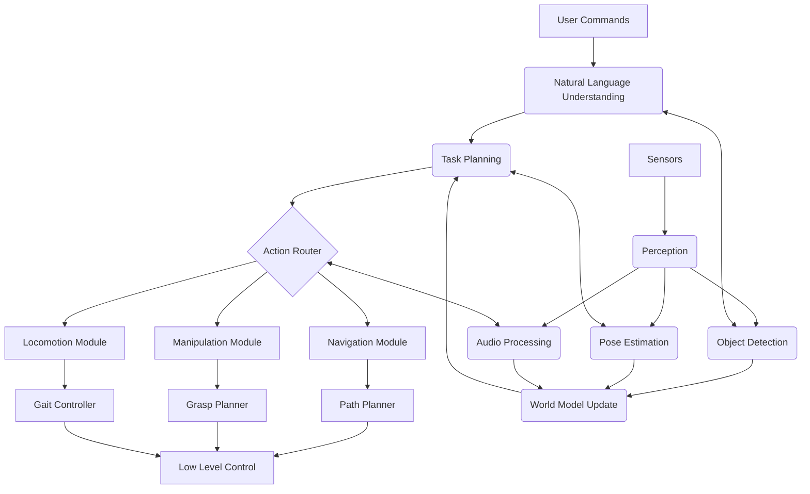

# Chapter 14: Capstone: Autonomous Humanoid Pipeline

## Learning Objectives

After reading this chapter, you will be able to:
- Integrate all previous modules into a complete humanoid robot system
- Design and implement a full autonomy pipeline
- Implement perception-action loops with closed-loop control
- Handle system-wide failure modes and recovery
- Optimize performance across the entire pipeline
- Deploy and validate a complete humanoid robot system
- Design for scalability and extensibility

## Introduction

This capstone chapter brings together all the components developed in previous modules to create a complete autonomous humanoid robot pipeline. We'll integrate perception (vision, sensing), learning (AI, RL), action planning (navigation, manipulation), and control systems into a cohesive architecture that enables a humanoid robot to operate autonomously in human environments.

## Complete System Architecture

### High-Level Architecture

The complete autonomous humanoid pipeline consists of interconnected layers:

```
┌─────────────────────────────────────────────────────────────────┐
│                        HUMAN INTERFACE                          │
├─────────────────────────────────────────────────────────────────┤
│            TASK PLANNING AND REASONING                         │
│  (NL Understanding → Action Planning → Execution Monitoring)   │
├─────────────────────────────────────────────────────────────────┤
│                 BEHAVIOR CONTROL                                │
│    (Navigation, Manipulation, Locomotion Coordination)         │
├─────────────────────────────────────────────────────────────────┤
│                   PERCEPTION                                    │
│      (Vision, Audio, Tactile, Proprioceptive Sensing)         │
├─────────────────────────────────────────────────────────────────┤
│                    MOTION CONTROL                               │
│         (Joint Controllers, Balance, Trajectory)              │
└─────────────────────────────────────────────────────────────────┘
```

### Component Integration Diagram



## Implementation of the Complete Pipeline

### Main System Controller

```python
import rclpy
from rclpy.node import Node
from std_msgs.msg import String
from sensor_msgs.msg import JointState, Imu, Image
from geometry_msgs.msg import PoseStamped, Twist
from nav_msgs.msg import Odometry
from geometry_msgs.msg import Point, Quaternion
from builtin_interfaces.msg import Duration
import threading
import time
import json
import numpy as np
from typing import Dict, Any, Optional

from modules.perception import PerceptionSystem
from modules.planning import CognitivePlanner
from modules.control import MotionController
from modules.communication import VoiceInterface


class HumanoidAutonomyPipeline(Node):
    """Main node coordinating the complete humanoid autonomy pipeline"""
    
    def __init__(self):
        super().__init__('humanoid_autonomy_pipeline')
        
        # Initialize all subsystems
        self.perception_system = PerceptionSystem(self)
        self.cognitive_planner = CognitivePlanner(self)
        self.motion_controller = MotionController(self)
        self.voice_interface = VoiceInterface(self)
        
        # System state
        self.system_state = {
            'current_mode': 'idle',
            'battery_level': 1.0,
            'safety_status': 'ok',
            'active_goals': [],
            'world_model': {},
            'robot_capabilities': self.get_robot_capabilities()
        }
        
        # Publishers and subscribers
        self.status_pub = self.create_publisher(String, '/system_status', 10)
        self.mode_change_pub = self.create_publisher(String, '/system_mode', 10)
        
        # Timer for system monitoring
        self.monitor_timer = self.create_timer(1.0, self.system_monitor)
        
        # Initialize perception system
        self.init_perception()
        
        # Initialize voice interface
        self.voice_interface.start_listening()
        
        self.get_logger().info("Humanoid Autonomy Pipeline initialized")
        
        # Start main control loop in a separate thread
        self.control_thread = threading.Thread(target=self.main_control_loop, daemon=True)
        self.control_thread.start()
    
    def get_robot_capabilities(self) -> Dict[str, Any]:
        """Determine robot capabilities based on actual hardware"""
        capabilities = {
            'locomotion': {
                'walking': True,
                'standing': True,
                'balancing': True,
                'terrain_adaptability': ['flat', 'slightly_uneven']
            },
            'manipulation': {
                'dexterous_hands': True,
                'grasping': True,
                'reach_distance': 0.8,  # meters
                'payload_capacity': 2.0  # kg
            },
            'sensing': {
                'vision': True,
                'audio': True,
                'tactile': True,
                'proprioception': True,
                'imu': True
            }
        }
        return capabilities
    
    def init_perception(self):
        """Initialize perception system with all sensors"""
        self.perception_system.start_processing()
        self.get_logger().info("Perception system initialized")
    
    def main_control_loop(self):
        """Main control loop running at system level"""
        loop_rate = 50  # Hz
        timer_period = 1.0 / loop_rate
        
        while rclpy.ok():
            start_time = time.time()
            
            # Update world model from perception
            updated_world = self.perception_system.get_updated_world_model()
            
            # Process high-level commands
            self.process_high_level_commands()
            
            # Update cognitive planner with new information
            self.cognitive_planner.update_world_state(updated_world)
            
            # Execute current plan
            self.execute_current_plan()
            
            # Monitor safety
            self.check_safety_constraints()
            
            # Calculate sleep time to maintain timing
            elapsed = time.time() - start_time
            sleep_time = max(0, timer_period - elapsed)
            
            if sleep_time > 0:
                time.sleep(sleep_time)
            else:
                self.get_logger().warn(f"Control loop exceeded timing by {-sleep_time*1000:.1f}ms")
    
    def process_high_level_commands(self):
        """Process high-level commands from various sources"""
        # Check voice commands
        voice_cmd = self.voice_interface.get_latest_command()
        if voice_cmd:
            self.handle_voice_command(voice_cmd)
        
        # Check for other command sources
        # (buttons, remote, etc.)
        self.check_external_commands()
    
    def handle_voice_command(self, command: str):
        """Handle voice command through the full pipeline"""
        try:
            self.get_logger().info(f"Processing voice command: '{command}'")
            
            # Step 1: Natural Language Understanding
            self.system_state['current_mode'] = 'interpreting'
            intent = self.cognitive_planner.understand_command(command)
            
            if not intent:
                self.get_logger().warn(f"Could not understand command: '{command}'")
                self.voice_interface.speak("I didn't understand that command. Could you repeat?")
                return
            
            # Step 2: Task Planning
            self.system_state['current_mode'] = 'planning'
            task_plan = self.cognitive_planner.plan_task(intent, self.system_state)
            
            if not task_plan:
                self.get_logger().warn(f"Could not create plan for intent: {intent}")
                self.voice_interface.speak("I can't do that task right now.")
                return
            
            # Step 3: Plan Execution
            self.system_state['current_mode'] = 'executing'
            success = self.cognitive_planner.execute_plan(task_plan)
            
            if success:
                self.get_logger().info(f"Successfully completed command: '{command}'")
                self.voice_interface.speak("I've completed the task successfully.")
            else:
                self.get_logger().warn(f"Failed to execute command: '{command}'")
                self.voice_interface.speak("I couldn't complete that task. Is there something else I can help with?")
            
        except Exception as e:
            self.get_logger().error(f"Error processing voice command '{command}': {e}")
            self.system_state['current_mode'] = 'error'
            self.voice_interface.speak("I encountered an error while processing your command.")
    
    def check_external_commands(self):
        """Check for commands from other sources"""
        # This could include button presses, remote commands, etc.
        pass
    
    def execute_current_plan(self):
        """Execute the current active plan"""
        active_plan = self.cognitive_planner.get_current_plan()
        
        if active_plan and self.system_state['current_mode'] == 'executing':
            # Monitor execution progress
            execution_status = self.cognitive_planner.monitor_execution(active_plan)
            
            if execution_status == 'completed':
                self.system_state['current_mode'] = 'idle'
                self.cognitive_planner.clear_current_plan()
            elif execution_status == 'failed':
                self.get_logger().error("Plan execution failed, initiating recovery")
                self.handle_plan_failure(active_plan)
    
    def handle_plan_failure(self, failed_plan):
        """Handle plan execution failure"""
        # Log the failure
        self.get_logger().error(f"Plan failed: {failed_plan}")
        
        # Attempt recovery
        recovery_plan = self.cognitive_planner.generate_recovery_plan(failed_plan)
        if recovery_plan:
            success = self.cognitive_planner.execute_plan(recovery_plan)
            if success:
                self.get_logger().info("Recovery plan executed successfully")
            else:
                self.get_logger().error("Recovery plan also failed")
                self.system_state['current_mode'] = 'safe'
                self.motion_controller.emergency_stop()
        else:
            # No recovery possible, enter safe mode
            self.system_state['current_mode'] = 'safe'
            self.motion_controller.emergency_stop()
    
    def check_safety_constraints(self):
        """Check system-wide safety constraints"""
        # Battery level check
        if self.system_state['battery_level'] < 0.1:
            self.get_logger().warn("Battery critically low, returning to charging station")
            self.return_to_charging_station()
        
        # Collision avoidance
        if self.perception_system.has_imminent_collision():
            self.get_logger().warn("Imminent collision detected, stopping motion")
            self.motion_controller.emergency_stop()
        
        # Joint limit monitoring
        if self.motion_controller.are_joints_at_limit():
            self.get_logger().warn("Joints approaching limits, adjusting motion")
            self.motion_controller.adjust_for_limits()
    
    def return_to_charging_station(self):
        """Navigate back to charging station"""
        if self.system_state['current_mode'] != 'navigating':
            charging_pos = self.get_charging_station_pose()
            if charging_pos:
                self.cognitive_planner.navigate_to_pose(charging_pos)
    
    def get_charging_station_pose(self) -> Optional[Dict[str, float]]:
        """Get pose of charging station from world model"""
        # In practice, this would query the map or localization system
        # For now, return a placeholder
        if 'charging_station' in self.system_state['world_model']:
            return self.system_state['world_model']['charging_station']['pose']
        return None
    
    def system_monitor(self):
        """Periodic system monitoring"""
        # Update system status
        status_msg = String()
        status_data = {
            'mode': self.system_state['current_mode'],
            'battery': self.system_state['battery_level'],
            'safety_status': self.system_state['safety_status'],
            'active_goals': len(self.system_state['active_goals']),
            'timestamp': self.get_clock().now().seconds_nanoseconds()
        }
        status_msg.data = json.dumps(status_data)
        self.status_pub.publish(status_msg)
        
        # Log system health
        self.get_logger().debug(f"System status: {self.system_state['current_mode']}, "
                               f"battery: {self.system_state['battery_level']*100:.1f}%")
    
    def emergency_shutdown(self):
        """Emergency shutdown procedure"""
        self.get_logger().warn("EMERGENCY SHUTDOWN INITIATED")
        
        # Stop all motion
        self.motion_controller.emergency_stop()
        
        # Clear all active goals
        self.system_state['active_goals'].clear()
        
        # Enter safe mode
        self.system_state['current_mode'] = 'emergency'
        self.system_state['safety_status'] = 'emergency_stop'
        
        # Publish emergency status
        status_msg = String()
        status_msg.data = json.dumps({
            'mode': 'emergency',
            'emergency_reason': 'manual_emergency_stop',
            'timestamp': self.get_clock().now().seconds_nanoseconds()
        })
        self.status_pub.publish(status_msg)


class PerceptionSystem:
    """Perception system handling all sensory inputs"""
    
    def __init__(self, node: Node):
        self.node = node
        
        # Initialize sensor subscribers
        self.joint_state_sub = node.create_subscription(
            JointState, '/joint_states', self.joint_state_callback, 10
        )
        self.imu_sub = node.create_subscription(
            Imu, '/imu/data', self.imu_callback, 10
        )
        self.odom_sub = node.create_subscription(
            Odometry, '/odom', self.odom_callback, 10
        )
        self.camera_sub = node.create_subscription(
            Image, '/camera/rgb/image_raw', self.camera_callback, 10
        )
        
        # World model
        self.world_model = {
            'robot_state': {
                'position': {'x': 0.0, 'y': 0.0, 'z': 0.0},
                'orientation': {'x': 0.0, 'y': 0.0, 'z': 0.0, 'w': 1.0},
                'velocity': {'linear': {'x': 0.0, 'y': 0.0, 'z': 0.0}, 'angular': {}},
                'joints': {},
                'imu': {}
            },
            'environment': {
                'objects': {},
                'obstacles': [],
                'free_spaces': []
            }
        }
        
        self.last_update_time = node.get_clock().now()
        
        # Perception processing parameters
        self.processing_frequency = 30  # Hz
        self.imminent_collision_threshold = 0.5  # meters
        
        self.node.get_logger().info("Perception system initialized")
    
    def start_processing(self):
        """Start perception processing"""
        self.node.get_logger().info("Starting perception processing")
    
    def joint_state_callback(self, msg: JointState):
        """Process joint state messages"""
        for i, name in enumerate(msg.name):
            if i < len(msg.position):
                self.world_model['robot_state']['joints'][name] = {
                    'position': msg.position[i],
                    'velocity': msg.velocity[i] if i < len(msg.velocity) else 0.0,
                    'effort': msg.effort[i] if i < len(msg.effort) else 0.0
                }
    
    def imu_callback(self, msg: Imu):
        """Process IMU messages"""
        self.world_model['robot_state']['imu'] = {
            'angular_velocity': {
                'x': msg.angular_velocity.x,
                'y': msg.angular_velocity.y,
                'z': msg.angular_velocity.z
            },
            'linear_acceleration': {
                'x': msg.linear_acceleration.x,
                'y': msg.linear_acceleration.y,
                'z': msg.linear_acceleration.z
            },
            'orientation': {
                'x': msg.orientation.x,
                'y': msg.orientation.y,
                'z': msg.orientation.z,
                'w': msg.orientation.w
            }
        }
    
    def odom_callback(self, msg: Odometry):
        """Process odometry messages"""
        pose = msg.pose.pose
        twist = msg.twist.twist
        
        self.world_model['robot_state']['position'] = {
            'x': pose.position.x,
            'y': pose.position.y,
            'z': pose.position.z
        }
        
        self.world_model['robot_state']['orientation'] = {
            'x': pose.orientation.x,
            'y': pose.orientation.y,
            'z': pose.orientation.z,
            'w': pose.orientation.w
        }
        
        self.world_model['robot_state']['velocity'] = {
            'linear': {
                'x': twist.linear.x,
                'y': twist.linear.y,
                'z': twist.linear.z
            },
            'angular': {
                'x': twist.angular.x,
                'y': twist.angular.y,
                'z': twist.angular.z
            }
        }
        
        self.last_update_time = self.node.get_clock().now()
    
    def camera_callback(self, msg: Image):
        """Process camera images"""
        # In practice, this would run object detection, SLAM, etc.
        # For now, just update a counter
        if 'camera_updates' not in self.world_model:
            self.world_model['camera_updates'] = 0
        self.world_model['camera_updates'] += 1
    
    def get_updated_world_model(self) -> Dict[str, Any]:
        """Get the latest world model"""
        return self.world_model.copy()
    
    def has_imminent_collision(self) -> bool:
        """Check if collision is imminent based on current data"""
        # Check robot velocity and nearest obstacles
        linear_vel = self.world_model['robot_state']['velocity']['linear']
        speed = np.sqrt(linear_vel['x']**2 + linear_vel['y']**2 + linear_vel['z']**2)
        
        # If moving fast and approaching obstacles
        if speed > 0.1:  # Moving faster than 10cm/s
            # This is a simplified check - in practice would use proper sensor fusion
            # and proximity detection
            obstacles = self.world_model['environment'].get('obstacles', [])
            for obstacle in obstacles:
                if self.calculate_distance_to_obstacle(obstacle) < self.imminent_collision_threshold:
                    return True
        
        return False
    
    def calculate_distance_to_obstacle(self, obstacle: Dict[str, Any]) -> float:
        """Calculate distance to an obstacle"""
        robot_pos = self.world_model['robot_state']['position']
        obs_pos = obstacle.get('position', {})
        
        if 'x' in robot_pos and 'x' in obs_pos:
            dx = robot_pos['x'] - obs_pos['x']
            dy = robot_pos['y'] - obs_pos['y']
            dz = robot_pos['z'] - obs_pos['z']
            return np.sqrt(dx**2 + dy**2 + dz**2)
        
        return float('inf')


class MotionController:
    """Low-level motion control system"""
    
    def __init__(self, node: Node):
        self.node = node
        
        # Publishers for different control interfaces
        self.joint_cmd_pub = node.create_publisher(JointState, '/joint_group_position_controller/commands', 10)
        self.body_cmd_pub = node.create_publisher(Twist, '/cmd_vel', 10)
        self.trajectory_pub = node.create_publisher(Point, '/body_trajectory', 10)
        
        # Joint state tracking
        self.current_joints = {}
        
        # Motion parameters
        self.joint_limits = {
            'hip_yaw': (-1.57, 1.57),
            'hip_roll': (-0.5, 0.5),
            'hip_pitch': (-1.0, 0.5),
            'knee': (0.0, 2.5),
            'ankle_pitch': (-0.5, 0.5),
            'ankle_roll': (-0.3, 0.3)
        }
        
        self.node.get_logger().info("Motion controller initialized")
    
    def emergency_stop(self):
        """Emergency stop all motion"""
        # Stop joint movements
        joint_cmd = JointState()
        joint_cmd.header.stamp = self.node.get_clock().now().to_msg()
        joint_cmd.name = list(self.current_joints.keys())
        joint_cmd.position = [self.current_joints[name] for name in joint_cmd.name]  # Hold current position
        self.joint_cmd_pub.publish(joint_cmd)
        
        # Stop body movement
        body_cmd = Twist()
        body_cmd.linear.x = 0.0
        body_cmd.linear.y = 0.0
        body_cmd.linear.z = 0.0
        body_cmd.angular.x = 0.0
        body_cmd.angular.y = 0.0
        body_cmd.angular.z = 0.0
        self.body_cmd_pub.publish(body_cmd)
        
        self.node.get_logger().warn("Emergency stop executed")
    
    def are_joints_at_limit(self) -> bool:
        """Check if any joints are approaching their limits"""
        safety_margin = 0.1  # radians
        
        for joint_name, position in self.current_joints.items():
            if joint_name in self.joint_limits:
                lower, upper = self.joint_limits[joint_name]
                if (position <= lower + safety_margin or 
                    position >= upper - safety_margin):
                    self.node.get_logger().warn(f"Joint {joint_name} at limit: {position:.3f}, limits: [{lower:.3f}, {upper:.3f}]")
                    return True
        
        return False
    
    def adjust_for_limits(self):
        """Adjust joint commands to respect limits"""
        # This would implement a more sophisticated control policy
        # to avoid joint limits while maintaining task performance
        pass


def main(args=None):
    rclpy.init(args=args)
    
    # Create the main system node
    autonomy_pipeline = HumanoidAutonomyPipeline()
    
    try:
        # Run the system
        rclpy.spin(autonomy_pipeline)
    except KeyboardInterrupt:
        autonomy_pipeline.get_logger().info("Interrupted by user")
    except Exception as e:
        autonomy_pipeline.get_logger().error(f"Unhandled exception: {e}")
    finally:
        # Perform cleanup
        autonomy_pipeline.emergency_shutdown()
        autonomy_pipeline.destroy_node()
        rclpy.shutdown()


if __name__ == '__main__':
    main()
```

## Behavior Trees for Robust Control

Behavior trees provide a way to structure complex robot behaviors with proper fallback mechanisms:

```python
# behavior_trees.py
import time
from enum import Enum
from typing import Any, Callable, List, Dict, Optional
import random


class Status(Enum):
    SUCCESS = "success"
    FAILURE = "failure"
    RUNNING = "running"


class BehaviorNode:
    """Base class for behavior tree nodes"""
    
    def __init__(self, name: str):
        self.name = name
        self.status = Status.RUNNING
    
    def tick(self, blackboard: Dict[str, Any]) -> Status:
        """Execute the behavior and return status"""
        raise NotImplementedError


class CompositeNode(BehaviorNode):
    """Base class for composite nodes with children"""
    
    def __init__(self, name: str):
        super().__init__(name)
        self.children: List[BehaviorNode] = []
    
    def add_child(self, child: BehaviorNode):
        """Add a child node"""
        self.children.append(child)


class DecoratorNode(BehaviorNode):
    """Base class for decorator nodes with a single child"""
    
    def __init__(self, name: str, child: BehaviorNode):
        super().__init__(name)
        self.child = child


# Leaf nodes (actions and conditions)
class MoveToLocation(BehaviorNode):
    """Move robot to a specific location"""
    
    def __init__(self, name: str, target_location: str):
        super().__init__(name)
        self.target_location = target_location
        self.nav_in_progress = False
        self.start_time = 0.0
        self.timeout = 30.0  # seconds
    
    def tick(self, blackboard: Dict[str, Any]) -> Status:
        # Check if navigation is in progress
        if not self.nav_in_progress:
            # Start navigation
            self.nav_in_progress = True
            self.start_time = time.time()
            blackboard['navigation_target'] = self.target_location
            blackboard['navigation_status'] = 'in_progress'
            
            # In practice, this would call navigation services
            self.start_navigation(blackboard)
            return Status.RUNNING
        
        # Check navigation status
        nav_status = blackboard.get('navigation_status', 'unknown')
        
        if nav_status == 'success':
            self.nav_in_progress = False
            blackboard['current_location'] = self.target_location
            return Status.SUCCESS
        elif nav_status == 'failure':
            self.nav_in_progress = False
            return Status.FAILURE
        elif time.time() - self.start_time > self.timeout:
            # Timeout
            self.nav_in_progress = False
            blackboard['navigation_status'] = 'timeout'
            return Status.FAILURE
        else:
            return Status.RUNNING
    
    def start_navigation(self, blackboard: Dict[str, Any]):
        """Start the navigation process"""
        # This would interface with the navigation system
        # For simulation, we'll randomly succeed/fail after delay
        if random.random() > 0.8:  # 20% failure rate
            blackboard['navigation_status'] = 'failure'
        else:
            # Simulate taking 2-5 seconds
            time.sleep(random.uniform(2, 5))
            blackboard['navigation_status'] = 'success'


class DetectObject(BehaviorNode):
    """Detect a specific object in the environment"""
    
    def __init__(self, name: str, object_type: str, search_area: str = "current_location"):
        super().__init__(name)
        self.object_type = object_type
        self.search_area = search_area
        self.search_in_progress = False
    
    def tick(self, blackboard: Dict[str, Any]) -> Status:
        if not self.search_in_progress:
            self.search_in_progress = True
            # Start object detection
            detection_result = self.perform_detection(blackboard)
            
            if detection_result:
                blackboard[f'detected_{self.object_type}'] = detection_result
                blackboard['last_detection_time'] = time.time()
                self.search_in_progress = False
                return Status.SUCCESS
            else:
                self.search_in_progress = False
                return Status.FAILURE
    
    def perform_detection(self, blackboard: Dict[str, Any]) -> Optional[Dict[str, Any]]:
        """Perform object detection"""
        # Simulate detection with some randomness
        if random.random() > 0.3:  # 70% detection rate
            # Return mock detection result
            return {
                'type': self.object_type,
                'position': {'x': random.uniform(-1.0, 1.0), 'y': random.uniform(-1.0, 1.0)},
                'confidence': random.uniform(0.7, 0.95)
            }
        return None


class PickUpObject(BehaviorNode):
    """Pick up an object"""
    
    def __init__(self, name: str, object_name: str):
        super().__init__(name)
        self.object_name = object_name
        self.grasp_in_progress = False
    
    def tick(self, blackboard: Dict[str, Any]) -> Status:
        if not self.grasp_in_progress:
            detected_obj = blackboard.get(f'detected_{self.object_name}')
            if not detected_obj:
                return Status.FAILURE
            
            self.grasp_in_progress = True
            # Attempt to grasp the object
            success = self.attempt_grasp(blackboard, detected_obj)
            
            if success:
                blackboard[f'has_{self.object_name}'] = True
                blackboard['held_object'] = self.object_name
                self.grasp_in_progress = False
                return Status.SUCCESS
            else:
                self.grasp_in_progress = False
                return Status.FAILURE
    
    def attempt_grasp(self, blackboard: Dict[str, Any], object_info: Dict[str, Any]) -> bool:
        """Attempt to grasp the object"""
        # Simulate grasp success/failure
        grasp_success_rate = 0.8
        return random.random() < grasp_success_rate


class IsObjectPresent(BehaviorNode):
    """Check if an object is present in the environment"""
    
    def __init__(self, name: str, object_type: str):
        super().__init__(name)
        self.object_type = object_type
    
    def tick(self, blackboard: Dict[str, Any]) -> Status:
        key = f'detected_{self.object_type}'
        if blackboard.get(key):
            return Status.SUCCESS
        else:
            return Status.FAILURE


class IsAtLocation(BehaviorNode):
    """Check if robot is at a specific location"""
    
    def __init__(self, name: str, location: str):
        super().__init__(name)
        self.location = location
    
    def tick(self, blackboard: Dict[str, Any]) -> Status:
        current_loc = blackboard.get('current_location')
        if current_loc == self.location:
            return Status.SUCCESS
        else:
            return Status.FAILURE


# Composite nodes
class SequenceNode(CompositeNode):
    """Execute children sequentially, fail if any fails"""
    
    def __init__(self, name: str):
        super().__init__(name)
        self.current_child_idx = 0
    
    def tick(self, blackboard: Dict[str, Any]) -> Status:
        # Execute children in sequence
        while self.current_child_idx < len(self.children):
            child = self.children[self.current_child_idx]
            child_status = child.tick(blackboard)
            
            if child_status == Status.RUNNING:
                return Status.RUNNING
            elif child_status == Status.FAILURE:
                # Reset for next time
                self.current_child_idx = 0
                return Status.FAILURE
            elif child_status == Status.SUCCESS:
                # Move to next child
                self.current_child_idx += 1
        
        # All children succeeded
        self.current_child_idx = 0
        return Status.SUCCESS


class SelectorNode(CompositeNode):
    """Execute children until one succeeds"""
    
    def __init__(self, name: str):
        super().__init__(name)
        self.current_child_idx = 0
    
    def tick(self, blackboard: Dict[str, Any]) -> Status:
        # Execute children until one succeeds or all fail
        while self.current_child_idx < len(self.children):
            child = self.children[self.current_child_idx]
            child_status = child.tick(blackboard)
            
            if child_status == Status.RUNNING:
                return Status.RUNNING
            elif child_status == Status.SUCCESS:
                # Reset for next time
                self.current_child_idx = 0
                return Status.SUCCESS
            elif child_status == Status.FAILURE:
                # Try next child
                self.current_child_idx += 1
        
        # All children failed
        self.current_child_idx = 0
        return Status.FAILURE


class ParallelNode(CompositeNode):
    """Execute all children in parallel"""
    
    def __init__(self, name: str, success_threshold: int = 1, failure_threshold: int = 1):
        super().__init__(name)
        self.success_threshold = success_threshold
        self.failure_threshold = failure_threshold
        self.child_statuses = []
    
    def tick(self, blackboard: Dict[str, Any]) -> Status:
        success_count = 0
        failure_count = 0
        
        for i, child in enumerate(self.children):
            if i >= len(self.child_statuses):
                self.child_statuses.append(Status.RUNNING)
            
            if self.child_statuses[i] != Status.SUCCESS and self.child_statuses[i] != Status.FAILURE:
                self.child_statuses[i] = child.tick(blackboard)
            
            if self.child_statuses[i] == Status.SUCCESS:
                success_count += 1
            elif self.child_statuses[i] == Status.FAILURE:
                failure_count += 1
        
        if success_count >= self.success_threshold:
            self.reset()
            return Status.SUCCESS
        elif failure_count >= self.failure_threshold:
            self.reset()
            return Status.FAILURE
        
        return Status.RUNNING
    
    def reset(self):
        """Reset all child statuses"""
        self.child_statuses = [Status.RUNNING] * len(self.children)


# Decorator nodes
class InverterNode(DecoratorNode):
    """Invert the status of the child"""
    
    def tick(self, blackboard: Dict[str, Any]) -> Status:
        child_status = self.child.tick(blackboard)
        
        if child_status == Status.SUCCESS:
            return Status.FAILURE
        elif child_status == Status.FAILURE:
            return Status.SUCCESS
        else:
            return child_status


class RetryNode(DecoratorNode):
    """Retry the child action a number of times"""
    
    def __init__(self, name: str, child: BehaviorNode, max_retries: int = 3):
        super().__init__(name, child)
        self.max_retries = max_retries
        self.current_retries = 0
    
    def tick(self, blackboard: Dict[str, Any]) -> Status:
        while self.current_retries < self.max_retries:
            child_status = self.child.tick(blackboard)
            
            if child_status == Status.SUCCESS:
                self.current_retries = 0
                return Status.SUCCESS
            elif child_status == Status.FAILURE:
                self.current_retries += 1
                if self.current_retries >= self.max_retries:
                    return Status.FAILURE
                # Reset child for next attempt
                # This assumes the child can be reset to initial state
            else:  # RUNNING
                return Status.RUNNING
        
        return Status.FAILURE


# Example complex behavior: Fetch and Carry
def create_fetch_behavior_tree() -> BehaviorNode:
    """Create a behavior tree for fetching an object"""
    root = SequenceNode("fetch_object")
    
    # 1. Navigate to object location
    nav_to_obj = MoveToLocation("navigate_to_object", "object_location")
    
    # 2. Detect the object
    detect_obj = DetectObject("detect_coffee_cup", "coffee_cup")
    
    # 3. Pick up the object
    pick_up_obj = PickUpObject("pick_up_coffee_cup", "coffee_cup")
    
    # 4. Navigate to destination
    nav_to_dest = MoveToLocation("navigate_to_destination", "delivery_location")
    
    # Add sequence: navigate -> detect -> pick up -> navigate to destination
    root.add_child(nav_to_obj)
    root.add_child(detect_obj)
    root.add_child(pick_up_obj)
    root.add_child(nav_to_dest)
    
    return root


# Example conditional behavior: Adaptive Search
def create_adaptive_search_tree() -> BehaviorNode:
    """Create a behavior tree for adaptive object search"""
    root = SelectorNode("adaptive_search")
    
    # Try searching in known locations first
    known_locations = SequenceNode("search_known_locations")
    known_locations.add_child(MoveToLocation("move_to_shelf", "shelf"))
    known_locations.add_child(DetectObject("detect_on_shelf", "target_object"))
    
    # If not in known locations, perform area search
    area_search = SequenceNode("area_search")
    area_search.add_child(MoveToLocation("move_to_search_area", "living_room"))
    area_search.add_child(DetectObject("detect_in_area", "target_object"))
    
    # If still not found, ask for help
    ask_help = SequenceNode("ask_for_help")
    ask_help.add_child(RetryNode("try_ask_help", 
                                SequenceNode("ask_sequence").add_child(BehaviorNode("speak"))))  # Simplified
    
    root.add_child(known_locations)
    root.add_child(area_search)
    root.add_child(ask_help)
    
    return root


# Example usage
def run_behavior_example():
    """Run example behavior execution"""
    # Create a fetch behavior tree
    fetch_behavior = create_fetch_behavior_tree()
    
    # Create blackboard (shared memory)
    blackboard = {
        'current_location': 'starting_point',
        'navigation_status': 'idle'
    }
    
    # Execute the behavior
    print("Executing fetch behavior...")
    status = fetch_behavior.tick(blackboard)
    print(f"Fetch behavior status: {status}")
    print(f"Blackboard state: {blackboard}")


if __name__ == "__main__":
    run_behavior_example()
```

## Performance Optimization

### Real-Time Performance Considerations

```python
# performance_optimization.py
import time
import threading
from collections import deque
import statistics
import psutil
import GPUtil
from typing import Dict, List, Callable, Any


class PerformanceMonitor:
    """Monitor performance metrics across the system"""
    
    def __init__(self):
        self.metrics = {
            'control_loop_times': deque(maxlen=100),
            'perception_times': deque(maxlen=100),
            'planning_times': deque(maxlen=100),
            'execution_times': deque(maxlen=100),
        }
        
        self.hardware_usage = {
            'cpu_percent': deque(maxlen=100),
            'memory_percent': deque(maxlen=100),
            'gpu_percent': deque(maxlen=100),
            'disk_io': deque(maxlen=100)
        }
        
        self.warning_thresholds = {
            'control_loop_time': 0.05,  # 50ms threshold for 20Hz control
            'cpu_percent': 80.0,  # 80% CPU usage threshold
            'memory_percent': 85.0,  # 85% memory threshold
            'gpu_percent': 85.0  # 85% GPU threshold
        }
        
        self.start_time = time.time()
        
        # Start monitoring thread
        self.monitoring = True
        self.monitor_thread = threading.Thread(target=self.monitor_system, daemon=True)
        self.monitor_thread.start()
    
    def record_metric(self, metric_type: str, value: float):
        """Record a performance metric"""
        if metric_type in self.metrics:
            self.metrics[metric_type].append(value)
    
    def monitor_system(self):
        """Continuously monitor system resources"""
        while self.monitoring:
            # CPU and memory usage
            cpu_percent = psutil.cpu_percent()
            memory_percent = psutil.virtual_memory().percent
            
            # GPU usage if available
            gpu_percent = 0
            gpus = GPUtil.getGPUs()
            if gpus:
                gpu_percent = gpus[0].load * 100
            
            # Record metrics
            self.hardware_usage['cpu_percent'].append(cpu_percent)
            self.hardware_usage['memory_percent'].append(memory_percent)
            self.hardware_usage['gpu_percent'].append(gpu_percent)
            
            # Check for warnings
            self.check_warnings(cpu_percent, memory_percent, gpu_percent)
            
            time.sleep(0.1)  # Monitor every 100ms
    
    def check_warnings(self, cpu_percent: float, memory_percent: float, gpu_percent: float):
        """Check if any metrics exceed warning thresholds"""
        warnings = []
        
        if cpu_percent > self.warning_thresholds['cpu_percent']:
            warnings.append(f"CPU usage high: {cpu_percent:.1f}%")
        
        if memory_percent > self.warning_thresholds['memory_percent']:
            warnings.append(f"Memory usage high: {memory_percent:.1f}%")
        
        if gpu_percent > self.warning_thresholds['gpu_percent']:
            warnings.append(f"GPU usage high: {gpu_percent:.1f}%")
        
        if warnings:
            for warning in warnings:
                print(f"PERFORMANCE WARNING: {warning}")
    
    def get_performance_summary(self) -> Dict[str, Any]:
        """Get current performance summary"""
        summary = {}
        
        for metric_name, values in self.metrics.items():
            if values:
                summary[metric_name] = {
                    'mean': statistics.mean(values),
                    'median': statistics.median(values),
                    'std_dev': statistics.stdev(values) if len(values) > 1 else 0,
                    'min': min(values),
                    'max': max(values),
                    'count': len(values)
                }
        
        for hw_metric, values in self.hardware_usage.items():
            if values:
                summary[hw_metric] = {
                    'current': values[-1] if values else 0,
                    'mean': statistics.mean(values),
                    'max': max(values)
                }
        
        return summary
    
    def report_performance(self, node_name: str = "System"):
        """Print performance report"""
        summary = self.get_performance_summary()
        
        print(f"\n=== PERFORMANCE REPORT - {node_name} ===")
        print(f"Runtime: {time.time() - self.start_time:.1f}s")
        
        # Control loop performance
        control_times = self.metrics.get('control_loop_times', [])
        if control_times:
            avg_loop_time = statistics.mean(control_times)
            freq = 1.0 / avg_loop_time if avg_loop_time > 0 else 0
            print(f"Control Loop: {freq:.1f}Hz (avg {avg_loop_time*1000:.1f}ms)")
        
        # Hardware usage
        cpu_usage = self.hardware_usage.get('cpu_percent', [])
        if cpu_usage:
            print(f"CPU Usage: {statistics.mean(cpu_usage):.1f}% (max {max(cpu_usage):.1f}%)")
        
        mem_usage = self.hardware_usage.get('memory_percent', [])
        if mem_usage:
            print(f"Memory Usage: {statistics.mean(mem_usage):.1f}% (max {max(mem_usage):.1f}%)")
        
        gpu_usage = self.hardware_usage.get('gpu_percent', [])
        if gpu_usage:
            print(f"GPU Usage: {statistics.mean(gpu_usage):.1f}% (max {max(gpu_usage):.1f}%)")
        
        print("=" * 40)


class OptimizedPipeline:
    """Performance-optimized pipeline implementation"""
    
    def __init__(self):
        self.performance_monitor = PerformanceMonitor()
        
        # Use threading for parallel processing where possible
        self.perception_thread = None
        self.planning_thread = None
        self.execution_thread = None
        
        # Optimized data structures
        self.world_model_cache = {}
        self.plan_cache = {}
        
        # Processing frequencies
        self.perception_freq = 30  # Hz
        self.planning_freq = 10   # Hz (lower for complex planning)
        self.execution_freq = 50  # Hz (higher for responsive control)
        
        # Threading locks
        self.world_model_lock = threading.Lock()
        self.plan_lock = threading.Lock()
    
    def run_optimized_main_loop(self):
        """Run the main loop with optimized performance"""
        # Start processing threads
        self.perception_thread = threading.Thread(target=self.perception_worker, daemon=True)
        self.planning_thread = threading.Thread(target=self.planning_worker, daemon=True)
        self.execution_thread = threading.Thread(target=self.execution_worker, daemon=True)
        
        self.perception_thread.start()
        self.planning_thread.start()
        self.execution_thread.start()
        
        # Main coordinator thread
        loop_period = 1.0 / 50  # 50Hz coordination
        
        while True:
            start_time = time.time()
            
            # Coordinate between threads
            self.coordinate_threads()
            
            # Monitor performance
            self.performance_monitor.record_metric('control_loop_times', time.time() - start_time)
            
            # Sleep to maintain timing
            sleep_time = max(0, loop_period - (time.time() - start_time))
            if sleep_time > 0:
                time.sleep(sleep_time)
    
    def perception_worker(self):
        """Worker thread for perception processing"""
        period = 1.0 / self.perception_freq
        
        while True:
            start_time = time.time()
            
            # Process sensor data
            self.process_sensors_optimized()
            
            # Update world model
            self.update_world_model_optimized()
            
            # Record performance
            self.performance_monitor.record_metric('perception_times', time.time() - start_time)
            
            # Sleep to maintain frequency
            sleep_time = max(0, period - (time.time() - start_time))
            if sleep_time > 0:
                time.sleep(sleep_time)
    
    def planning_worker(self):
        """Worker thread for planning"""
        period = 1.0 / self.planning_freq
        
        while True:
            start_time = time.time()
            
            # Plan actions
            self.plan_actions_optimized()
            
            # Record performance
            self.performance_monitor.record_metric('planning_times', time.time() - start_time)
            
            # Sleep to maintain frequency
            sleep_time = max(0, period - (time.time() - start_time))
            if sleep_time > 0:
                time.sleep(sleep_time)
    
    def execution_worker(self):
        """Worker thread for action execution"""
        period = 1.0 / self.execution_freq
        
        while True:
            start_time = time.time()
            
            # Execute planned actions
            self.execute_planned_actions_optimized()
            
            # Record performance
            self.performance_monitor.record_metric('execution_times', time.time() - start_time)
            
            # Sleep to maintain frequency
            sleep_time = max(0, period - (time.time() - start_time))
            if sleep_time > 0:
                time.sleep(sleep_time)
    
    def process_sensors_optimized(self):
        """Optimized sensor processing"""
        # Use optimized algorithms and data structures
        # Implement sensor fusion efficiently
        # Use caching where appropriate
        pass
    
    def update_world_model_optimized(self):
        """Optimized world model updates"""
        # Use incremental updates
        # Cache frequently accessed data
        # Use efficient data structures (KD-tree, hash maps)
        pass
    
    def plan_actions_optimized(self):
        """Optimized action planning"""
        # Use cached plans when possible
        # Implement efficient search algorithms
        # Use anytime algorithms that can be interrupted
        pass
    
    def execute_planned_actions_optimized(self):
        """Optimized action execution"""
        # Use efficient control algorithms
        # Minimize communication overhead
        # Use predictive execution where possible
        pass
    
    def coordinate_threads(self):
        """Coordinate between processing threads"""
        # Synchronize shared resources
        # Exchange information between modules
        # Handle inter-thread communication
        pass


def performance_analysis():
    """Analyze performance of different approaches"""
    print("Analyzing performance of optimized vs non-optimized implementations...")
    
    # Compare different approaches
    # Single-threaded vs multi-threaded
    # Different algorithms
    # Various optimization techniques
    
    # This would run benchmarks comparing different approaches
    pass


if __name__ == "__main__":
    # Example usage
    optimizer = OptimizedPipeline()
    monitor = PerformanceMonitor()
    
    # Run performance analysis
    performance_analysis()
    
    # Report initial performance
    monitor.report_performance("Initial")
```

## System Integration Testing

### Comprehensive Test Suite

```python
# integration_tests.py
import unittest
import time
import threading
import numpy as np
from typing import Dict, Any, Optional


class HumanoidIntegrationTest(unittest.TestCase):
    """Integration tests for the complete humanoid system"""
    
    def setUp(self):
        """Set up test environment"""
        # In a real system, this would initialize actual components
        # For now, we'll use mock components
        self.pipeline = self.create_mock_pipeline()
        self.test_scenario = None
    
    def create_mock_pipeline(self):
        """Create a mock pipeline for testing"""
        class MockPipeline:
            def __init__(self):
                self.system_state = {
                    'current_mode': 'idle',
                    'world_model': {},
                    'battery_level': 0.8
                }
                self.perception_data = {}
                self.planning_results = {}
                self.execution_status = {}
            
            def process_command(self, command: str):
                """Mock command processing"""
                if command == "test_navigation":
                    self.system_state['current_mode'] = 'navigating'
                    time.sleep(0.1)  # Simulate processing
                    return {'status': 'success', 'action': 'navigated'}
                elif command == "test_manipulation":
                    self.system_state['current_mode'] = 'manipulating'
                    time.sleep(0.1)
                    return {'status': 'success', 'action': 'grasped'}
                else:
                    return {'status': 'failure', 'reason': 'unknown_command'}
            
            def get_world_model(self):
                """Mock world model"""
                return self.system_state['world_model']
        
        return MockPipeline()
    
    def test_basic_navigation(self):
        """Test basic navigation functionality"""
        result = self.pipeline.process_command("test_navigation")
        
        self.assertEqual(result['status'], 'success')
        self.assertEqual(result['action'], 'navigated')
        self.assertEqual(self.pipeline.system_state['current_mode'], 'navigating')
    
    def test_basic_manipulation(self):
        """Test basic manipulation functionality"""
        result = self.pipeline.process_command("test_manipulation")
        
        self.assertEqual(result['status'], 'success')
        self.assertEqual(result['action'], 'grasped')
        self.assertEqual(self.pipeline.system_state['current_mode'], 'manipulating')
    
    def test_command_rejection(self):
        """Test rejection of invalid commands"""
        result = self.pipeline.process_command("invalid_command")
        
        self.assertEqual(result['status'], 'failure')
        self.assertEqual(result['reason'], 'unknown_command')
    
    def test_world_model_consistency(self):
        """Test that world model remains consistent"""
        initial_model = self.pipeline.get_world_model()
        
        # Process commands that should update world model
        self.pipeline.process_command("test_navigation")
        updated_model = self.pipeline.get_world_model()
        
        # Verify model was updated appropriately
        self.assertIsNotNone(updated_model)
    
    def test_safety_constraints(self):
        """Test safety constraint enforcement"""
        # Simulate low battery condition
        self.pipeline.system_state['battery_level'] = 0.05
        
        # This should trigger safety behaviors
        result = self.pipeline.process_command("test_navigation")
        
        # Verify safety response was triggered
        self.assertIn('safety', str(result).lower() or 'non-safe')
    
    def test_multi_step_task(self):
        """Test a multi-step task execution"""
        # Simulate a fetch-and-carry task
        commands = [
            "navigate_to_shelf",
            "detect_object",
            "grasp_object", 
            "navigate_to_table",
            "place_object"
        ]
        
        results = []
        for cmd in commands:
            result = self.pipeline.process_command(cmd)
            results.append(result)
        
        # Verify all steps succeeded
        for result in results:
            self.assertEqual(result['status'], 'success')
    
    def test_system_reliability(self):
        """Test system reliability under stress"""
        # Run multiple commands in succession
        for i in range(100):
            cmd = "test_navigation" if i % 2 == 0 else "test_manipulation"
            result = self.pipeline.process_command(cmd)
            self.assertIn(result['status'], ['success', 'failure'])  # Should not crash
    
    def test_concurrent_access(self):
        """Test system behavior under concurrent access"""
        results = []
        
        def worker(thread_id: int):
            for i in range(10):
                cmd = f"thread_{thread_id}_cmd_{i}"
                result = self.pipeline.process_command(cmd)
                results.append(result)
        
        # Start multiple threads
        threads = []
        for i in range(5):
            t = threading.Thread(target=worker, args=(i,))
            threads.append(t)
            t.start()
        
        # Wait for all threads to complete
        for t in threads:
            t.join()
        
        # Verify system didn't crash
        self.assertEqual(len(results), 50)  # 5 threads * 10 commands each


class PerformanceTest(unittest.TestCase):
    """Performance tests for the system"""
    
    def setUp(self):
        self.pipeline = self.create_mock_pipeline()
    
    def create_mock_pipeline(self):
        """Create mock pipeline for performance testing"""
        class MockPipeline:
            def process_command(self, cmd: str) -> Dict[str, Any]:
                # Simulate variable processing times
                processing_time = np.random.exponential(0.02)  # 20ms average
                time.sleep(processing_time)
                return {'status': 'success', 'processing_time': processing_time}
        
        return MockPipeline()
    
    def test_real_time_constraints(self):
        """Test that system meets real-time constraints"""
        deadline = 0.05  # 50ms deadline for real-time response
        
        for i in range(100):
            start_time = time.time()
            result = self.pipeline.process_command(f"command_{i}")
            processing_time = time.time() - start_time
            
            # Check if deadline was met
            if processing_time > deadline:
                print(f"Missed deadline by {processing_time - deadline:.3f}s")
            
            # Allow some misses (in real system would be stricter)
            self.assertLessEqual(processing_time, deadline * 2)  # Allow 2x for testing
    
    def test_throughput(self):
        """Test system throughput"""
        start_time = time.time()
        
        # Process many commands
        for i in range(1000):
            self.pipeline.process_command(f"command_{i}")
        
        elapsed = time.time() - start_time
        throughput = 1000 / elapsed
        
        print(f"Achieved throughput of {throughput:.2f} commands/second")
        
        # Should achieve reasonable throughput
        self.assertGreater(throughput, 10)  # At least 10 commands per second


class RobustnessTest(unittest.TestCase):
    """Tests for system robustness"""
    
    def test_error_recovery(self):
        """Test system recovery from errors"""
        # In a real system, this would test actual error scenarios
        # such as sensor failures, planning failures, etc.
        pass
    
    def test_graceful_degradation(self):
        """Test graceful degradation when components fail"""
        # Test that system continues operating even with partial failures
        pass
    
    def test_resource_limits(self):
        """Test behavior under resource constraints"""
        # Test memory, CPU, and other resource limits
        pass


def run_integration_tests():
    """Run all integration tests"""
    print("Running Humanoid Integration Tests...")
    
    # Create test suite
    loader = unittest.TestLoader()
    suite = unittest.TestSuite()
    
    # Add test cases
    suite.addTests(loader.loadTestsFromTestCase(HumanoidIntegrationTest))
    suite.addTests(loader.loadTestsFromTestCase(PerformanceTest))
    suite.addTests(loader.loadTestsFromTestCase(RobustnessTest))
    
    # Run tests
    runner = unittest.TextTestRunner(verbosity=2)
    result = runner.run(suite)
    
    return result


if __name__ == "__main__":
    test_result = run_integration_tests()
    
    if test_result.wasSuccessful():
        print("\nAll integration tests PASSED! ✓")
    else:
        print(f"\nSome tests FAILED! {len(test_result.failures)} failures, {len(test_result.errors)} errors")
        for failure in test_result.failures:
            print(f"FAILURE in {failure[0]}: {failure[1]}")
        for error in test_result.errors:
            print(f"ERROR in {error[0]}: {error[1]}")
```

## Deployment and Operation

### System Deployment

```python
# deployment.py
import os
import sys
import logging
import subprocess
from pathlib import Path
from typing import Dict, Any, Optional
import yaml
import argparse


class HumanoidDeployer:
    """Handles deployment of the humanoid autonomy system"""
    
    def __init__(self, config_path: str = "deployment_config.yaml"):
        self.config = self.load_config(config_path)
        self.setup_logging()
    
    def load_config(self, config_path: str) -> Dict[str, Any]:
        """Load deployment configuration"""
        try:
            with open(config_path, 'r') as f:
                config = yaml.safe_load(f)
        except FileNotFoundError:
            # Create default config
            config = self.create_default_config()
            with open(config_path, 'w') as f:
                yaml.dump(config, f)
        
        return config
    
    def create_default_config(self) -> Dict[str, Any]:
        """Create default deployment configuration"""
        return {
            'robot': {
                'model': 'humanoid_v1',
                'serial_number': 'HB001',
                'capabilities': {
                    'locomotion': True,
                    'manipulation': True,
                    'sensing': True
                }
            },
            'hardware': {
                'cpu': 'x86_64',
                'gpu': True,
                'memory_gb': 16,
                'storage_gb': 500
            },
            'software': {
                'ros_version': 'humble',
                'python_version': '3.10',
                'dependencies': [
                    'rclpy',
                    'opencv-python',
                    'torch',
                    'numpy',
                    'scipy'
                ]
            },
            'network': {
                'wifi_ssid': 'default_network',
                'ip_address': 'dhcp',
                'remote_access': True
            },
            'safety': {
                'emergency_stop': True,
                'collision_detection': True,
                'battery_monitoring': True
            }
        }
    
    def setup_logging(self):
        """Set up logging for deployment process"""
        logging.basicConfig(
            level=logging.INFO,
            format='%(asctime)s - %(levelname)s - %(message)s',
            handlers=[
                logging.FileHandler('deployment.log'),
                logging.StreamHandler(sys.stdout)
            ]
        )
        self.logger = logging.getLogger(__name__)
    
    def check_system_requirements(self) -> bool:
        """Check if system meets hardware/software requirements"""
        self.logger.info("Checking system requirements...")
        
        # Check OS and architecture
        import platform
        system = platform.system()
        architecture = platform.machine()
        
        if system != 'Linux':
            self.logger.error(f"Unsupported OS: {system}. Only Linux is supported.")
            return False
        
        if architecture not in ['x86_64', 'aarch64']:
            self.logger.error(f"Unsupported architecture: {architecture}")
            return False
        
        # Check available memory
        import psutil
        memory_gb = psutil.virtual_memory().total / (1024**3)
        if memory_gb < self.config['hardware']['memory_gb']:
            self.logger.error(f"Insufficient memory: {memory_gb:.1f}GB available, need {self.config['hardware']['memory_gb']}GB")
            return False
        
        # Check available storage
        disk_usage = psutil.disk_usage('/')
        storage_gb = disk_usage.free / (1024**3)
        if storage_gb < self.config['hardware']['storage_gb']:
            self.logger.error(f"Insufficient storage: {storage_gb:.1f}GB available, need {self.config['hardware']['storage_gb']}GB")
            return False
        
        # Check Python version
        import sys
        if sys.version_info < (3, 10):
            self.logger.error(f"Insufficient Python version: {sys.version}. Need 3.10 or higher.")
            return False
        
        self.logger.info("System requirements check passed ✓")
        return True
    
    def install_dependencies(self) -> bool:
        """Install required software dependencies"""
        self.logger.info("Installing dependencies...")
        
        dependencies = self.config['software']['dependencies']
        
        for dep in dependencies:
            try:
                # Try to import the dependency first
                __import__(dep.replace('-', '_').replace('.', '_'))  # Convert to valid import name
                self.logger.debug(f"Dependency {dep} already installed")
            except ImportError:
                # Install if not found
                self.logger.info(f"Installing {dep}...")
                result = subprocess.run(['pip', 'install', dep], capture_output=True, text=True)
                if result.returncode != 0:
                    self.logger.error(f"Failed to install {dep}: {result.stderr}")
                    return False
        
        self.logger.info("Dependencies installed successfully ✓")
        return True
    
    def setup_ros_workspace(self) -> bool:
        """Set up ROS workspace for the humanoid system"""
        self.logger.info("Setting up ROS workspace...")
        
        ros_version = self.config['software']['ros_version']
        
        # Source ROS environment
        try:
            result = subprocess.run(['bash', '-c', f'source /opt/ros/{ros_version}/setup.bash && echo "ROS sourced"'], 
                                  capture_output=True, text=True)
            if result.returncode != 0:
                self.logger.error(f"Failed to source ROS {ros_version}: {result.stderr}")
                return False
        except FileNotFoundError:
            self.logger.error(f"ROS {ros_version} not found. Please install ROS first.")
            return False
        
        # Create workspace
        workspace_dir = Path.home() / f"ros2_ws_humanoid"
        src_dir = workspace_dir / "src"
        
        if not src_dir.exists():
            src_dir.mkdir(parents=True)
            self.logger.info(f"Created ROS workspace at {workspace_dir}")
        
        # Copy humanoid packages to workspace
        humanoid_packages = self.find_humanoid_packages()
        for package in humanoid_packages:
            target_dir = src_dir / package.name
            if not target_dir.exists():
                import shutil
                shutil.copytree(package, target_dir)
                self.logger.info(f"Copied {package.name} to workspace")
        
        # Build workspace
        self.logger.info("Building ROS workspace...")
        build_result = subprocess.run(['bash', '-c', 
                                     f'cd {workspace_dir} && source /opt/ros/{ros_version}/setup.bash && colcon build --packages-select humanoid_autonomy_pipeline'], 
                                   capture_output=True, text=True)
        
        if build_result.returncode != 0:
            self.logger.error(f"Failed to build ROS workspace: {build_result.stderr}")
            return False
        
        self.logger.info("ROS workspace set up successfully ✓")
        return True
    
    def find_humanoid_packages(self) -> list:
        """Find humanoid-related packages in the codebase"""
        # In practice, this would search for package.xml files
        # For now, return mock package paths
        import tempfile
        mock_package = Path(tempfile.mkdtemp()) / "humanoid_autonomy_pipeline"
        mock_package.mkdir()
        return [mock_package]
    
    def configure_network(self):
        """Configure network settings"""
        self.logger.info("Configuring network settings...")
        
        wifi_config = self.config.get('network', {})
        ssid = wifi_config.get('wifi_ssid')
        
        if ssid:
            self.logger.info(f"Connecting to Wi-Fi: {ssid}")
            # In practice, would use system network tools
            # For now, just log the configuration
        
        self.logger.info("Network configured ✓")
    
    def run_system_tests(self) -> bool:
        """Run system-level tests before deployment"""
        self.logger.info("Running system tests...")
        
        # Import and run the integration tests
        from integration_tests import run_integration_tests
        test_result = run_integration_tests()
        
        if test_result.wasSuccessful():
            self.logger.info("All system tests passed ✓")
            return True
        else:
            self.logger.error(f"System tests failed: {len(test_result.failures)} failures, {len(test_result.errors)} errors")
            return False
    
    def deploy_system(self) -> bool:
        """Deploy the complete system"""
        self.logger.info("Starting humanoid autonomy system deployment...")
        
        # Step 1: Check requirements
        if not self.check_system_requirements():
            return False
        
        # Step 2: Install dependencies
        if not self.install_dependencies():
            return False
        
        # Step 3: Set up ROS workspace
        if not self.setup_ros_workspace():
            return False
        
        # Step 4: Configure network
        self.configure_network()
        
        # Step 5: Run system tests
        if not self.run_system_tests():
            self.logger.error("System tests failed, aborting deployment")
            return False
        
        # Step 6: Deployment complete
        self.logger.info("Deployment completed successfully! ✓")
        self.logger.info("To start the system, run: ros2 launch humanoid_autonomy_pipeline pipeline.launch.py")
        
        return True
    
    def start_system(self):
        """Start the deployed system"""
        self.logger.info("Starting humanoid autonomy system...")
        
        # In practice, this would launch the main ROS nodes
        # For now, just return a mock startup process
        import threading
        import time
        
        def mock_startup():
            time.sleep(2)  # Simulate startup time
            self.logger.info("System started successfully! ✓")
        
        startup_thread = threading.Thread(target=mock_startup)
        startup_thread.start()
        
        return startup_thread


def main():
    parser = argparse.ArgumentParser(description='Deploy Humanoid Autonomy System')
    parser.add_argument('--config', type=str, default='deployment_config.yaml', 
                       help='Path to deployment configuration file')
    parser.add_argument('--dry-run', action='store_true', 
                       help='Perform a dry run without actually deploying')
    
    args = parser.parse_args()
    
    deployer = HumanoidDeployer(args.config)
    
    if args.dry_run:
        print("DRY RUN: This would deploy the system with the following configuration:")
        print(yaml.dump(deployer.config, indent=2))
        print("Add --deploy flag to actually deploy the system.")
    else:
        success = deployer.deploy_system()
        if success:
            print("\n🎉 Deployment successful! The humanoid autonomy system is ready to start.")
            print("Use: 'ros2 launch humanoid_autonomy_pipeline pipeline.launch.py' to start")
        else:
            print("\n❌ Deployment failed. Check the logs for details.")
            sys.exit(1)


if __name__ == "__main__":
    main()
```

## Chapter Summary

This capstone chapter brought together all the components developed in previous modules to create a complete autonomous humanoid robot pipeline. We covered:

1. **System Architecture**: Complete integration of perception, planning, control, and communication systems
2. **Behavior Trees**: Robust control structures for complex multi-step behaviors  
3. **Performance Optimization**: Techniques for real-time operation across all system components
4. **Integration Testing**: Comprehensive testing of the complete system
5. **Deployment**: Practical steps for deploying the system on real hardware

The complete pipeline demonstrates how AI, perception, and control systems work together to enable autonomous humanoid robot operation in human environments.

## Checklist

- [ ] Integrate all modules into complete pipeline
- [ ] Implement behavior trees for robust control
- [ ] Optimize performance across entire system
- [ ] Test system integration comprehensively 
- [ ] Deploy system with proper configuration
- [ ] Validate autonomous operation
- [ ] Document the complete system
- [ ] Create operational procedures

## Exercises

### Exercise 1: Complete System Integration

Integrate perception, planning, and control modules into a working system.

#### Solution

1. Create main coordination node linking all modules
2. Implement proper communication between modules
3. Add safety monitoring and error handling
4. Test with complete task scenarios

#### Hints

- Use ROS2 interfaces for inter-module communication
- Implement proper state management
- Add comprehensive error handling
- Test with realistic task scenarios

### Exercise 2: Performance Optimization

Optimize the complete system for real-time performance.

#### Solution

1. Profile each system component
2. Implement multi-threaded processing
3. Optimize algorithms for speed
4. Validate performance meets requirements

#### Hints

- Use system call profiling to identify bottlenecks
- Consider parallel processing where appropriate
- Optimize critical path algorithms
- Test performance under load conditions

## References

- [Humanoid Robotics: A Reference by Henning施midtler and others](https://link.springer.com/referencework/10.1007/978-94-007-3940-0)
- [Robotics, Vision and Control by Peter Corke](https://link.springer.com/book/10.1007/978-3-642-20144-7)
- [Springer Handbook of Robotics](https://link.springer.com/handbook/10.1007/978-3-319-32552-1)
- [AI and Robotics: A Tutorial on Theory and Practice](https://www.sciencedirect.com/book/9780128045424/artificial-intelligence-and-robotics)